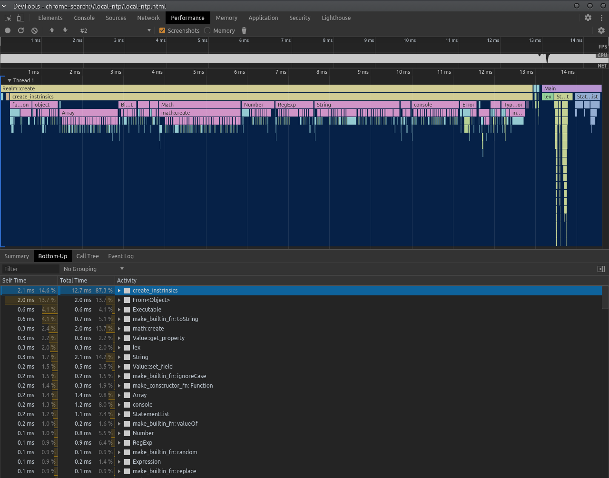

Hello World!

Boa is an experimental Javascript lexer, parser and compiler written in Rust. Currently, it has support for some of the language. It can be embedded in Rust projets fairly easily and also used from the command line.  
Boa also exists to serve as a Rust implementation of the EcmaScript specification, there will be areas where we can utilise Rust and its fantastic ecosystem to make fast, concurrent and safe optimisations.

Roughly every month to 6 weeks we have a new version of Boa. Today we're please to announce our latest release, version 0.9.  
0.9 is by far the biggest release weve had since Boa began. You see the full changes from the [changelog](none yet). The milestone behind this version was further optimisation and an increase in new features. We can show you how we can identify areas that can be optimised.

## Better tooling for profiling

Boa became the first Rust project to make use of [measureme](https://github.com/rust-lang/measureme), this was only used by the Rust team themselves to profile the compiler. Luckily the framework is in a good enough state to be used by other projects too, and in this release we gave it a try.  
Measure me lets you profile various areas of your choosing, then you can generate a trace file which can be loaded into Chromium or various other tools for analysis.

We took it for a spin (which you'll see in Object Specialization).

Below is an example of our trace, this is using a measureme tool called `summarize`

```
+----------------------------+-----------+-----------------+----------+------------+
| Item                       | Self time | % of total time | Time     | Item count |
+----------------------------+-----------+-----------------+----------+------------+
| From<Object>               | 1.04ms    | 14.776          | 1.04ms   | 146        |
+----------------------------+-----------+-----------------+----------+------------+
| new_object                 | 356.50µs  | 5.082           | 533.50µs | 18         |
+----------------------------+-----------+-----------------+----------+------------+
| create_instrinsics         | 263.50µs  | 3.756           | 6.38ms   | 1          |
+----------------------------+-----------+-----------------+----------+------------+
| make_builtin_fn: toString  | 218.50µs  | 3.114           | 290.50µs | 12         |
+----------------------------+-----------+-----------------+----------+------------+
| String                     | 81.60µs   | 1.163           | 961.60µs | 1          |
+----------------------------+-----------+-----------------+----------+------------+
```

You can read more about Rust's usage of measureme [here](https://blog.rust-lang.org/inside-rust/2020/02/25/intro-rustc-self-profile.html).  
You can also read more about Boa's usage of measureme [here](https://github.com/boa-dev/boa/blob/master/docs/profiling.md)

## Object Specialization

In JavaScript internal metadata for objects are stored in `internal slots`. In Boa we stored internal slots as a hashmap tied to the object, then the values themselves were `JSValue`s. This meant we needed to constantly unwrap them into a rust primitive to access the data. Secondly we were restricted as to what type of data we could put in internal slots. For example, lets say we want to implement [`Set`](https://developer.mozilla.org/en-US/docs/Web/JavaScript/Reference/Global_Objects/Set) by using the native [`HashSet`](https://doc.rust-lang.org/std/collections/struct.HashSet.html) as a backing store, this would not be possible.

By changing how internal data is handled for some of our builtin objects and removing a whole bunch of redundent access checks, we managed to speed up the interpereter.

Boa would spend a significant amount of time converting back and forth between JS Values and primitive values. We found a huge amount of time was spent in `Value::set_field` before any code had even been executed. `set_field` was slow due to the amount of updating of internal slots as part of setting up. Here you can see realm creation takes roughly 60ms.

_We use [Crox](https://github.com/rust-lang/measureme/blob/master/crox/Readme.md) to convert our measureme data into a format Chrome's performance tab understands_


creating a fast path for many of these builtins gives is a huge speed up.  
Many builtIn objects keep the same spec-compliant metadata but held in an enum now.

```rust
/// Defines the different types of objects.
#[derive(Debug, Trace, Finalize, Clone)]
pub enum ObjectData {
    Array,
    BigInt(RcBigInt),
    Boolean(bool),
    Function(Function),
    String(RcString),
    Number(f64),
    Symbol(RcSymbol),
    Error,
    Ordinary,
}
```



This gave us a 65% speed up and reduced startup time by well over half.

## Optimised Type Comparisons

If you've ever called `typeof` in JavaScript, you get a string value descibing the primitive type of it's argument. Boa was doing the same thing internally for comparing (using the "get_type()" call), however getting the string value from each primitive then comparing them is not very performant.  
Now, thanks to @Lan2u we have a rust `Type` enum which makes comparing more efficient and on average brings another 8% performance boost.
